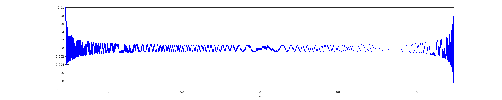

# sommerfeld-sqrt-highk

A little observation about sqrt singularities in Sommerfeld integrals,
tested in MATLAB/Octave, addressing a question of Leslie Greengard.

We consider a Sommerfeld
(ie, along-interface Fourier) integral representation of 2D Helmholtz
Green's functions in half-spaces.
Let $x$ and $y$ be parameters related to source-target separations
in the horizontal ($x$) and vertical ($y$) directions respectively.
Let $\kappa$ be the overall wavenumber, which is large.
A paradigm integral is

$$
I = \int_{-\kappa}^\kappa \frac{e^{ix \lambda} e^{iy\sqrt{\kappa^2-\lambda^2}}}
{\sqrt{\kappa^2-\lambda^2}} d\lambda
$$

where $\lambda$ is the $x$-Fourier variable.
This omits the evanescent part; see standard literature
such as [1], specifically, Eq. (23).

The oscillatory nature of integrand
suggests a trapezoid rule in order to get spectral accuracy.
The $-1/2$-power singularities at the endpoints suggests
applying Alpert endpoint corrections to the trapezoid rule [2].
These have been packaged by Andras Pataki then by myself in
[MPSpack](https://github.com/ahbarnett/mpspack).
If $y=0$ we see that this combination is very successful, using
Alpert 16th order rule (from his Table 7) on the above integral:

```matlab
K = 200*2*pi;     % overall wavenumber, for 200 wavelengths across unit domain
x = 1;            % toy model of source-target x-coord separation
f = @(l) exp(1i*x*l)./sqrt(K^2-l.^2);      % integrand no y-term
addpath mpspack   % or wherever you installed it
for N=400:200:1600
  [x,w]=quadr.QuadNodesInterval(-K,K,N,[],2,2,16);     % "2" means 1/sqrt type
  [N, real(w'*f(x))]                       % apply quadrature rule
end
```
The results (after minor filtering) show 11-digit accuracy by $N=1600$ nodes:
```
                       400        0.631576677565719
                       600        0.0499037154298492
                       800        0.0499953278789497
                      1000        0.0499950196661369
                      1200        0.0499950242643807
                      1400        0.0499950241884407
                      1600        0.0499950241828673
```
This is quite acceptable, since the Nyquist expectation of 2 nodes per
wavelength would be $N=2k=800$. Indeed high-order convergence begins
at around that $N$. We are done at 4 points per wavelength.
(Note that the *periodic* trapezoid rule would
be expected to start convergence at half Nyquist, ie, 1 node per wavelength.)

However, with a unit-sized $y$ separation from the interface, the
rule needs *way* more points:

```matlab
y = 1;
f = @(l) exp(1i*x*l + 1i*y*sqrt(K^2-l.^2))./sqrt(K^2-l.^2);      % no y-term
for N=1e4:1e4:8e4
  [x,w]=quadr.QuadNodesInterval(-K,K,N,[],2,2,16); [N, real(w'*f(x))]
end
```
```
                     10000        0.0418564385412951
                     20000       -0.0121757351447327
                     30000       -0.0119843720596832
                     40000       -0.0119841697612409
                     50000       -0.0119841578608809
                     60000       -0.0119841588957764
                     70000       -0.0119841589390626
                     80000       -0.0119841589409531
```
Now $N=80000$ is needed to get the same 11-digit accuracy.
This is an unacceptable 200 points per wavelength,
and as $\kappa$ grows this ratio would continue to grow!
Yet the function does not appear to have many more total oscillations, so
what's going on? We plot it:
```
t=linspace(-K,K,1e4); plot(t,real(f(t)),'-');
axis([-K K -1e-2 1e-2]); xlabel('\lambda')
```


There are inverse sqrt singularities in amplitude that Alpert
was designed to address, but the real
culprit is the fact that the local oscillation frequency diverges
at $\lambda = \pm \kappa$, due to the $y$ term upstairs.
This term $e^{iy\sqrt{\kappa^2-\lambda^2}}$ is the composition
of the semicircle function with the complex exponential, so
the distance between oscillations at the endpoints becomes much
less than its typical value of ${\cal O}(1/\kappa)$;
it becomes as small as ${\cal O}(1/\kappa^2)$.
This explains why a vast oversampling is needed.

We see that a *global* transformation can be made which stretches those
packed oscillations out: let $\lambda = \kappa \cos t$, hence
$d\lambda = -\kappa \sin t \, dt$ will be used to change the weights.
By a happy coincidence this
also handles the 1/sqrt type multiplicative singularity, because
the Jacobean is $\kappa \sin t = \sqrt{\kappa^2-\lambda^2}$.
More rigorously, one may show that a transformation of squaring
type (as cos is locally around the singularity $\lambda_0$)
transforms functions in the
class $\phi(\lambda) + \psi(\lambda)/\sqrt{\lambda-\lambda_0}$
where $\phi$ and $\psi$ are locally analytic, into
locally analytic functions.

Thus we may use smooth-type end corrections, which exist for the higher
order 32. The results are great:

```matlab
for N=600:300:2100
  [t,w]=quadr.QuadNodesInterval(0,pi,N,[],1,1,32);    % "1" for smooth types
  [N, real(K*(w.*sin(t))'*f(K*cos(t)))]               % change var to lambda
end
```
```
                       600       -0.0311135015227045
                       900       -0.0120839847194038
                      1200       -0.0119842508538611
                      1500       -0.0119841587321117
                      1800       -0.0119841589370715
                      2100       -0.0119841589324932
```
We get 11 digits by around $N=2000$.
Since the cos transformation has stretched the central part by a
factor $\pi/2$, we would expect this factor more nodes by
Nyquist arguments. However, the order increase from 16 to 32 somewhat
compensates.
One sees that round-off error limits accuracy to about 11 digits.

In conclusion, a global cosine-type transformation, rather than
a mere endpoint-correction, is essential to handle
Sommerfeld integrals efficiently in the high-frequency limit.


### References

[1] L. Greengard, Jingfang Huang, V. Rokhlin and S. Wandzura, "Accelerating fast multipole methods for the Helmholtz equation at low frequencies," in IEEE Computational Science and Engineering, vol. 5, no. 3, pp. 32-38, July-Sept. 1998, doi: 10.1109/99.714591.

[2] B. K. Alpert, "Hybrid Gauss-Trapezoidal Quadrature Rules,"
SIAM J. Sci. Comput. 20(5) 1551-1584 (1999). doi: 10.1137/S106482759732514.
